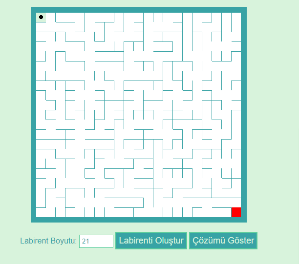

<p align="center">
  
</p>

# Labirent Projesi

## Proje Açıklaması

Bu proje, dinamik olarak bir labirent oluşturan, kullanıcıya bu labirentte gezinme imkanı tanıyan bir web uygulamasıdır.

[ Demo](https://abdullah-yilmazer.github.io/JS-maze-game/)


## Algoritmalar ve Uygulamaları

### Labirent Oluşturma Algoritması

Labirenti oluşturmak için "Depth-First Search" (DFS) algoritması kullanıldı. Bu algoritma, rastgele olarak seçilen bir başlangıç noktasından başlayarak tüm hücreleri ziyaret eder ve rastgele duvarları kaldırarak bir labirent oluşturur. İşte bu algoritmanın adımları:

1. Tüm hücreleri ziyaret edilmemiş olarak işaretleyin.
2. Bir hücre yığını (stack) oluşturun ve başlangıç hücresini bu yığına ekleyin.
3. Yığın boşalana kadar şu adımları tekrarlayın:
   - Yığının en üstündeki hücreyi alın.
   - Bu hücreden rastgele bir komşu hücre seçin (ziyaret edilmemiş olmalı).
   - Eğer ziyaret edilmemiş bir komşu hücre varsa:
     - Bu komşu hücreyi ziyaret edilmiş olarak işaretleyin.
     - Bu komşu hücre ile mevcut hücre arasındaki duvarı kaldırın.
     - Komşu hücreyi yığına ekleyin.
   - Eğer ziyaret edilmemiş komşu hücre yoksa, hücreyi yığından çıkarın.

```javascript
function generateMaze(size) {
  const maze = Array.from({ length: size }, () => Array(size).fill(15)); 
  const visited = Array.from({ length: size }, () => Array(size).fill(false));
  const walls = [];

  function addWalls(x, y) {
    if (x > 0 && !visited[y][x - 1]) walls.push({ x, y, direction: "left" });
    if (x < size - 1 && !visited[y][x + 1]) walls.push({ x, y, direction: "right" });
    if (y > 0 && !visited[y - 1][x]) walls.push({ x, y, direction: "up" });
    if (y < size - 1 && !visited[y + 1][x]) walls.push({ x, y, direction: "down" });
  }

  let x = Math.floor(Math.random() * size);
  let y = Math.floor(Math.random() * size);
  visited[y][x] = true;
  addWalls(x, y);

  while (walls.length > 0) {
    const { x, y, direction } = walls.splice(Math.floor(Math.random() * walls.length), 1)[0];

    let nx = x,
      ny = y;
    if (direction === "left") nx--;
    if (direction === "right") nx++;
    if (direction === "up") ny--;
    if (direction === "down") ny++;

    if (nx >= 0 && ny >= 0 && nx < size && ny < size && !visited[ny][nx]) {
      visited[ny][nx] = true;

      if (direction === "left") {
        maze[y][x] &= ~1;
        maze[ny][nx] &= ~4;
      } else if (direction === "right") {
        maze[y][x] &= ~4;
        maze[ny][nx] &= ~1;
      } else if (direction === "up") {
        maze[y][x] &= ~2;
        maze[ny][nx] &= ~8;
      } else if (direction === "down") {
        maze[y][x] &= ~8;
        maze[ny][nx] &= ~2;
      }

      addWalls(nx, ny);
    }
  }

  return maze;
}
```

### Labirenti Çözme Algoritması

Labirenti çözmek için "Breadth-First Search" (BFS) algoritması kullanıldı. Bu algoritma, başlangıç hücresinden bitiş hücresine giden en kısa yolu bulur. İşte bu algoritmanın adımları:

1. Başlangıç hücresini bir kuyruk (queue) içerisine ekleyin.
2. Kuyruk boşalana kadar şu adımları tekrarlayın:
   - Kuyruğun başındaki yolu alın.
   - Bu yolun son hücresini inceleyin.
   - Eğer bu hücre bitiş hücresi ise, çözümü döndürün.
   - Bu hücreye komşu olan hücreleri ziyaret edin ve her birini yeni bir yol olarak kuyruğa ekleyin.

```javascript
function solveMaze(maze, size) {
  const directions = [
    { x: 1, y: 0 },
    { x: -1, y: 0 },
    { x: 0, y: 1 },
    { x: 0, y: -1 },
  ];
  const start = { x: 0, y: 0 };
  const end = { x: size - 1, y: size - 1 };
  const queue = [[start]];
  const visited = Array.from({ length: size }, () => Array(size).fill(false));
  visited[0][0] = true;

  while (queue.length) {
    const path = queue.shift();
    const { x, y } = path[path.length - 1];

    if (x === end.x && y === end.y) {
      return path;
    }

    for (const { x: dx, y: dy } of directions) {
      const nx = x + dx;
      const ny = y + dy;

      if (nx >= 0 && ny >= 0 && nx < size && ny < size && !visited[ny][nx] && canMove(maze[y][x], dx, dy)) {
        visited[ny][nx] = true;
        queue.push([...path, { x: nx, y: ny }]);
      }
    }
  }
  return [];
}

function canMove(cellValue, dx, dy) {
  if (dx === 1 && !(cellValue & 4)) return true; 
  if (dx === -1 && !(cellValue & 1)) return true; 
  if (dy === 1 && !(cellValue & 8)) return true; 
  if (dy === -1 && !(cellValue & 2)) return true; 
  return false;
}
```

### Oyuncu Hareketi ve Güncellemeleri

Oyuncunun labirentte hareket etmesini sağlamak için klavye olayları dinlenir. Oyuncunun hareketi, belirli bir yönde geçerli bir hareket olup olmadığını kontrol eden `canMove` fonksiyonu kullanılarak gerçekleştirilir. Oyuncunun hareket ettiği hücreler işaretlenir ve önceki hücrelerdeki işaretlemeler güncellenir.

```javascript
document.addEventListener("keydown", movePlayer);

function movePlayer(event) {
  const directionMap = {
    ArrowUp: { dx: 0, dy: -1 },
    ArrowDown: { dx: 0, dy: 1 },
    ArrowLeft: { dx: -1, dy: 0 },
    ArrowRight: { dx: 1, dy: 0 },
  };

  if (PlayerCanMove) {
    if (directionMap[event.key]) {
      const { dx, dy } = directionMap[event.key];
      const newX = playerPosition.x + dx;
      const newY = playerPosition.y + dy;

      if (newX >= 0 && newY >= 0 && newX < size && newY < size && canMove(maze[playerPosition.y][playerPosition.x], dx, dy)) {
        previousPosition = { ...playerPosition };
        playerPosition.x = newX;
        playerPosition.y = newY;
        updatePlayerPosition(dx, dy);
      }
    }
  }
}

function updatePlayerPosition(dx, dy) {
  const oldCell = document.querySelector(`.cell[data-x="${previousPosition.x}"][data-y="${previousPosition.y}"]`);
  const newCell = document.querySelector(`.cell[data-x="${playerPosition.x}"][data-y="${playerPosition.y}"]`);

  oldCell.classList.remove("player");
  newCell.classList.add("player");

  let oldSpan = oldCell.querySelector("span");
  let newSpan = newCell.querySelector("span");

  if (!oldSpan) {
    oldSpan = document.createElement("span");
    oldCell.appendChild(oldSpan);
  }
  if (!newSpan) {
    newSpan = document.createElement("span");
    newCell.appendChild(newSpan);
  }

  if (
    previousPositions.length > 0 &&
    previousPositions[previousPositions.length - 1].x === playerPosition.x &&
    previousPositions[previousPositions.length - 1].y === playerPosition.y
  ) {
    previousPositions.pop();
    if (oldSpan) {
      oldSpan.className = "";
    }

    if (dx === 1) {
      newSpan.classList.remove("to-left");
    } else if (dx === -1) {
      newSpan.classList.remove("to-right");
    } else if (dy === 1) {
      newSpan.classList.remove("to-top");
    } else if (dy === -1) {
      newSpan.classList.remove("to-bottom");
    }
  } else {
    if (dx === 1) {
      oldSpan.classList.add("to-right");
      newSpan.classList.add("right-hand");
    } else if (dx === -1) {
      oldSpan.classList.add("to-left");
      newSpan.classList.add("left-hand");
    } else if (dy === 1) {
      oldSpan.classList.add("to-bottom");
      newSpan.classList.add("bottom-hand");
    } else if (dy === -1) {
      oldSpan.classList.add("to-top");
      newSpan.classList.add("top-hand");
    }
    previousPositions.push({ ...previousPosition });
  }
}
```

### Labirenti Render Etme

Labirenti ve oyuncunun konumunu render etmek için HTML elemanları dinamik olarak oluşturulur ve güncellenir. Labirentin hücreleri, duvarları ve oyuncu pozisyonu bu şekilde gösterilir.

```javascript
function renderMaze(maze, solution = []) {
  mazeContainer.style.gridTemplateColumns = `repeat(${size}, var(--cell-size))`;
  mazeContainer.style.gridTemplateRows = `repeat(${size}, var(--cell-size))`;
  mazeContainer.innerHTML = "";

  for (let y = 0; y < size; y++) {
    for (let x = 0; x < size; x++) {
      const cell = document.createElement("div");
      cell.className = "cell";
      cell.dataset.x = x;
      cell.dataset.y = y;
      if (x === 0 && y === 0) cell.classList.add("start");
      if (x === size - 1 && y === size - 1) cell.classList.add("end");
      if (solution.some((pos) => pos.x === x && pos.y === y)) {
        cell.classList.add("solution");
      }

      addWalls(cell, maze[y][x]);
      mazeContainer.appendChild(cell);
    }
  }

  const playerCell = document.querySelector(`.cell[data-x="${playerPosition.x}"][data-y="${playerPosition.y}"]`);
  playerCell.classList.add("player");
}

function addWalls(cell, value) {
  if (value & 1) cell.classList.add("left");
  if (value & 2) cell.classList.add("top");
  if (value & 4) cell.classList.add("right");
  if (value & 8) cell.classList.add("bottom");
}
```

## Sonuç

Bu proje, dinamik bir labirent oluşturma ve çözme uygulamasıdır. Kullanıcıların labirenti çözmesi için bir yol bulmalarını sağlar ve bu çözüm yolunu animasyonla gösterir. Proje, HTML, CSS ve JavaScript kullanılarak geliştirilmiş ve "Depth-First Search" ve "Breadth-First Search" algoritmalarını kullanarak labirent oluşturma ve çözme işlevlerini gerçekleştirmiştir.

## Katkıda Bulunma
Katkıda bulunmak isterseniz, lütfen bir çekme isteği (pull request) gönderin veya bir konu (issue) açın.

## Lisans
Bu proje MIT lisansı altında lisanslanmıştır. Daha fazla bilgi için [MIT License](https://github.com/Abdullah-Yilmazer/JS-maze-game/blob/main/LICENSE) dosyasına bakın.
